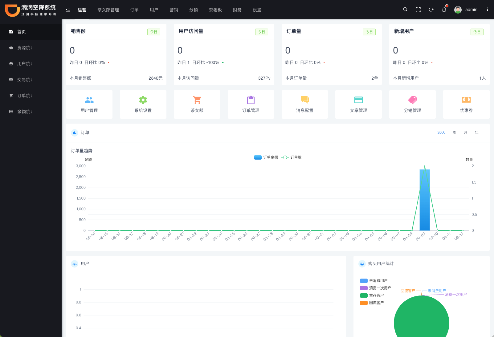
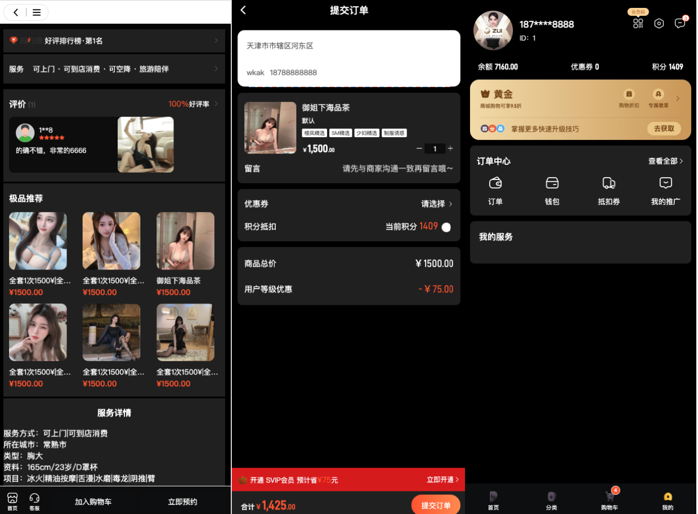
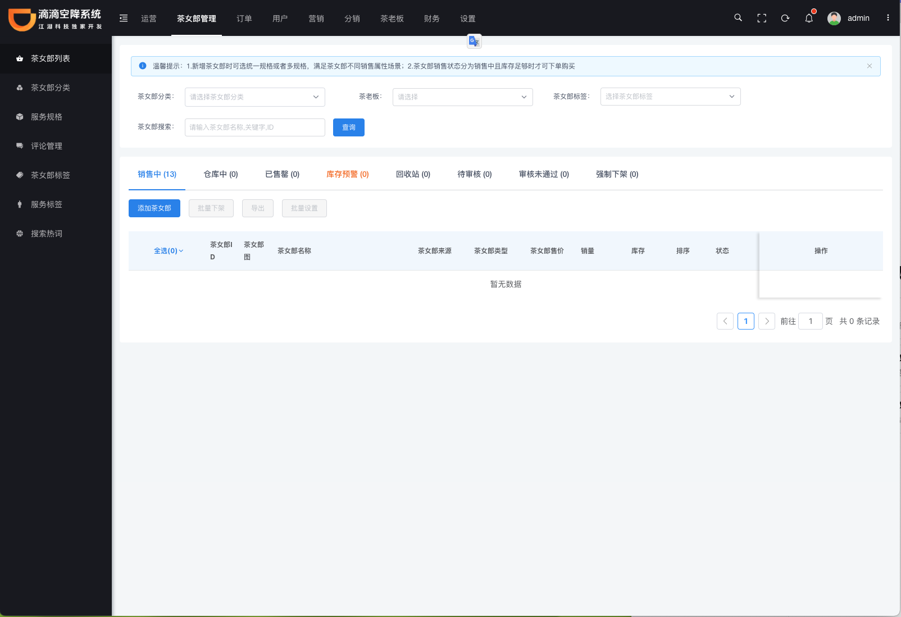
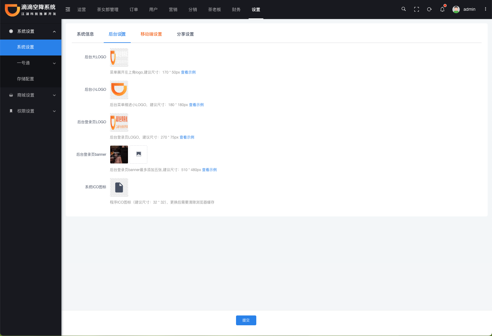
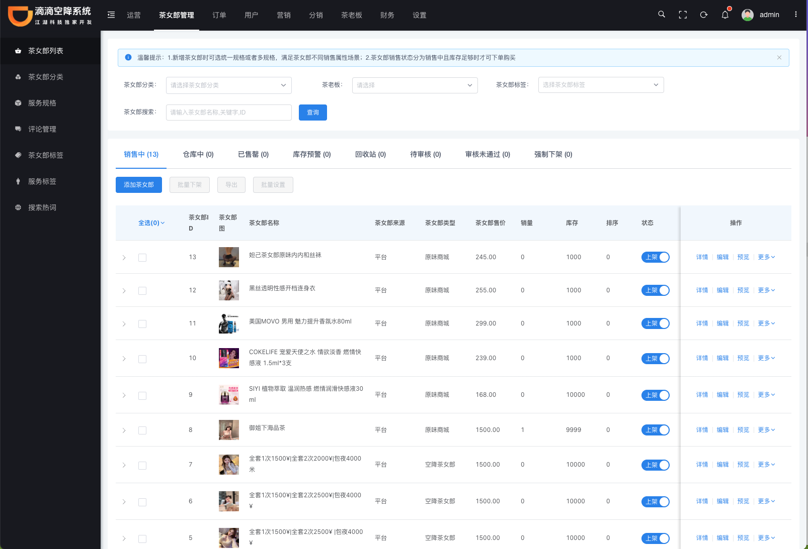

    

# 👏👏👏开源版本空降上门系统👏👏👏
（滴滴到家），上门，到家，开源框架，技术支持，售后服务

[官网](http://www.aprxapp.cn/) |
[在线体验](http://di.aprxapp.cn/) |
[帮助文档](http://www.aprxapp.cn/zt/homeservicev6/index.html) |
[技术社区](http://www.aprxapp.cn/zt/homeservice/baojia.html)

[comment]: <> ([宽屏预览]&#40;https://gitee.com/ZhongBangKeJi/crmeb_java/blob/master/README.md&#41;)

    如果对您有帮助，您可以点右上角 "Star" ❤️ 支持一下 谢谢！

---

### 📖 简介：

开源版本空降上门系统，后台基于 ThinkPhp6.0 开发，后台UI采用iview admin企业版框架，系统高效稳定，UI美观精致，独立部署，二开很方便、分销推广、等多种经营需求，自用、做二开项目都很合适。

源版本空降上门系统PHP：http://di.aprxapp.cn

上门SPA、外围服务、名媛空降、等为一体的团妹解决方案

---

### 💡 系统亮点：
>1.前端框架升级为uni-app，公小程序、H5、APP等多端合一   
>2.后台独立出admin api 接口，后台前后端分离 
>3.后台UI框架为VUE+ Iview Admin框架 
>4.swoole 框架加持，高并发 
>5.支持Redis队列，降低流量高峰，解除耦合，高可用。 
>6.后台标准接口、前后端分离，二次开发更方便 
>7.数据统计分析,使用ECharts图表统计，实现用户、产品、订单、资金等统计分析。 
>8.后台页面加载，跳转流畅 
>9.组件化开发，可复用，开发便捷 

---

### 💻 运行环境及框架：
~~~
* Nignx 1.18~1.2.1/apache 2.2

* PHP 7.1~7.4

* MySQL 5.5~5.7

* Redis 6.0

* Supervisor 2.2
~~~

### 🎬 系统演示：

移动端：https://java.crmeb.net 
WEBPC管理端：https://admin.java.crmeb.net 
账号密码： demo/crmeb.com 

自己搭建演示账号
移动端 18292417675 / crmeb@123456
管理端 admin / 123456

[想了解CRMEB开源商城系统Java版整体框架，你可以戳这里快速掌握！](https://doc.crmeb.com/java/crmeb_java/2049)

---

### 💟 UI界面
#### 核心功能
s

### 📱 移动端预览

### WEB PC管理端预览

---
### 📲 CRMEB开源技术交流群
扫码进群可领取开源版接口文档、产品功能清单、高清UI设计图、思维脑图！

#### 📈 技术社区
找方法、提bug、看官方消息、拿活跃大奖！
https://www.crmeb.com/ask/thread/list/152

#### 📞 技术交流
跟着官方，不迷路！欢迎扫码加入CRMEB 开源项目群，一手消息及资源，尽在掌握！ 
CRMEB JAVA 技术交流QQ群 1群 🈵️ 
CRMEB JAVA 技术交流QQ群 2群 🈵️ 
CRMEB JAVA 技术交流QQ群 3群 640230510 🈵️ 群已满 
<!-- [CRMEB开源商城系统开发QQ频道已开启，点击加入一起交流学习](https://pd.qq.com/s/1v2yb4e0p) 
 -->
使用中遇到bug 或者问题可以在gitee 上提 Issues

---

